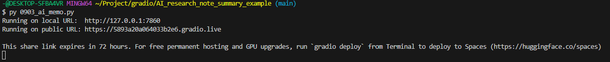
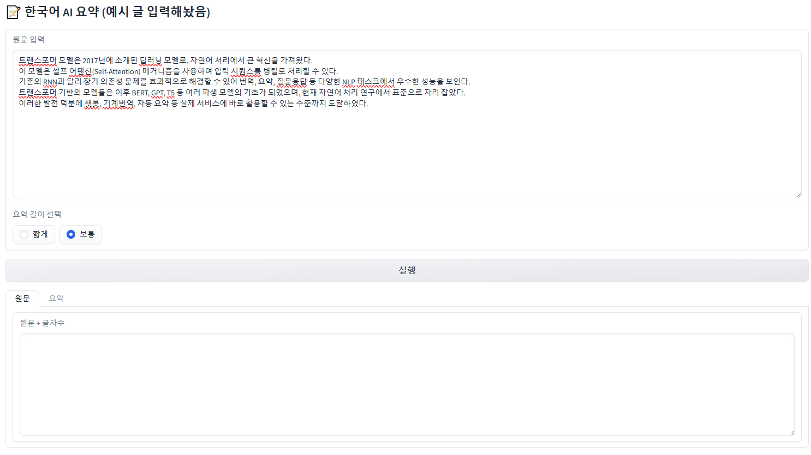
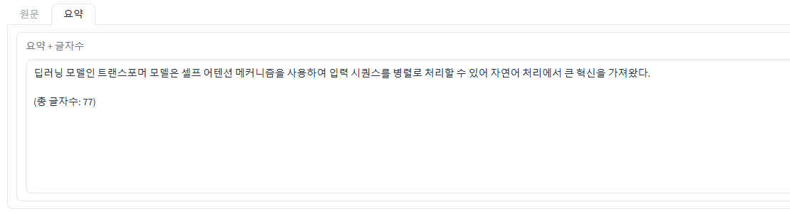

# AI 학습/연구 메모 요약기

텍스트(논문, 블로그 글, 수업 필기 등)를 입력하면 핵심 내용을 **요약**하고, **글자 수**와 **요약길이 조절**까지 제공하는 간단한 연구 메모 지원 도구입니다.  
Gradio를 사용하여 웹 UI에서 쉽게 실행할 수 있으며, 로컬 LLM을 활용하여 외부 API 없이 동작합니다.

---

## 환경세팅

1. **Python 3.9 이상 설치**
2. **가상환경 생성 (권장)**
```bash
source gvenv/bin/activate
# Windows
gvenv\Scripts\activate
```

## 필요 라이브러리 설치

```bash
pip install --upgrade pip
pip install torch torchvision torchaudio --index-url https://download.pytorch.org/whl/cpu
pip install transformers==4.40.0
pip install gradio==3.45.0
pip install scikit-learn
```
---

## 프로젝트 구성
```bash
AI_research_note_summary/
├─ 0903_ai_memo.py        # 메인 실행 파일
├─ README.md              # 프로젝트 설명
└─ requirements.txt       # 설치 라이브러리 목록 (선택)
```
## 사용방법
1. 코드실행
```bash
python 0903_ai_memo.py
or 
py 0903_ai_memo.py
```
2. Gradio 웹 UI 접속
- 터미널에 표시된 로컬 주소(예: http://127.0.0.1:7860) 접속
- 입력란에 텍스트를 붙여넣고 실행 버튼 클릭

3. 출력 탭 및 버튼 설명
- 원문 : 입력한 텍스트와 글자 수 표시
- 요약 : 핵심 내용 요약 및 글자 수 표시
- 요약 길이 버튼 : 요약 길이를 설정함.

---
## 기능 세부 설명
1. 한국어 요약
- lcw99/t5-base-korean-text-summary 모델 사용
- 요약 길이는 짧게 / 보통 두 가지 선택 가능
2. 글자 수 표시
- 원문과 요약 텍스트 아래에 총 글자 수 표시
3. 요약 길이 설정
- 버튼 클릭을 통해 요약 길이 설정 가능
4. Gradio UI
- Tabs 방식으로 출력
- 원문, 요약 각각 별도 탭으로 확인 가능

---
## 주의사항 
- 입력 텍스트가 너무 짧거나 단어만 있을 경우, 요약 결과가 부정확할 수 있음
- 로컬 CPU 환경에서는 대량 텍스트 처리 시 시간이 걸릴 수 있음
- LLM 모델은 Hugging Face에서 다운로드 후 사용되므로, 초기 실행 시 인터넷 연결 필요

---
## 추가 이미지
1. 실행 시키는 코드


2. gradio로 실행한 화면 UI


3. 실행 후 결과 장면
